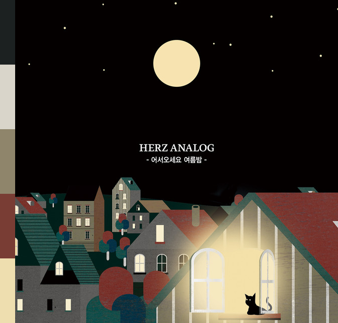
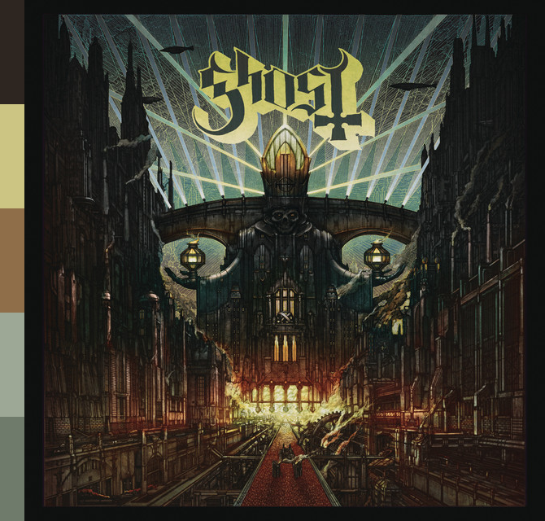

# Rust Backend

Am slowly rewriting the image manipulation parts of the project in Rust.

I want to be able to identify images that have a strong red component in them so I can incorporate it into the dithering on the 3-colour E-ink display I'm using. I don't want to just add red to any image, as if there's not a strong red component the red just looks weird with such low resolution.

The plan:

1. Cluster the album art into its 5 main colours
2. If one of the clusters is close to the red of the E-ink display, mask the red sections out of the image.
3. Dither only the red parts of the image with a black-white-red colour palette
4. Dither the non-red parts of the image with a black-white colour palette.
5. Merge the two results, overwriting any extra red with the black-white dithered image.

## Image Cluster

A command line utility to cluster an image into `n` different colour clusters. Uses the `k-means` algorithm with the `k-means++` intial clustering.

Compares colours using Delta E in the `CIELAB` colour space.

```
image_cluster 0.1.0

USAGE:
    image_cluster.exe [OPTIONS] --num-clusters <NUM_CLUSTERS> <INPUT_IMAGE>

ARGS:
    <INPUT_IMAGE>    Path to the image to analyze

OPTIONS:
    -h, --help
            Print help information

    -m, --max-iterations <MAX_ITERATIONS>
            If specified, will stop the k-means clustering after <MAX_ITERATIONS> iterations

    -n, --num-clusters <NUM_CLUSTERS>
            Cluster the image into <NUM_CLUSTERS> clusters

    -o, --annotated-image-path <ANNOTATED_IMAGE_PATH>
            If specified, will save an image to the path provided with the image clusters annotated
            on the side

    -s, --image-size <IMAGE_SIZE>
            If specified, will resize the image such that the biggest side will be length
            <IMAGE_SIZE>

    -V, --version
            Print version information
```

### Sample Output

<table>
<tr>
<td>Command-line Arguments</td>
<td>Cluster Information</td>
<td>Annotated Image</td>
</tr>
<tr>
<td>

`image_cluster -n 5 ..\images\herz-analog-어서오세요-여름밤.png`

</td>

<td>

```json
[
    { colour: #F0DFB1, average_error: 107.93902, num_pixels: 30026 },
    { colour: #1C2121, average_error: 10.067805, num_pixels: 303786 },
    { colour: #795649, average_error: 120.86689, num_pixels: 44798 },
    { colour: #DBD7CD, average_error: 229.04242, num_pixels: 9270 },
    { colour: #A59779, average_error: 182.07202, num_pixels: 21720 }
]
```

</td>
<td>



</td>
</tr>

<tr>
<td>

`image_cluster -n 5 ..\images\ghost-meliora.png`

</td>

<td>

```json
{ colour: #2E2621, average_error: 7.3254786, num_pixels: 344375 }
{ colour: #8F6E49, average_error: 216.22577, num_pixels: 9834 }
{ colour: #9DA896, average_error: 302.45093, num_pixels: 12927 }
{ colour: #6F7B6B, average_error: 94.13946, num_pixels: 26929 }
{ colour: #CCC583, average_error: 195.49057, num_pixels: 15535 }
```

</td>
<td>



</td>
</tr>

</table>
